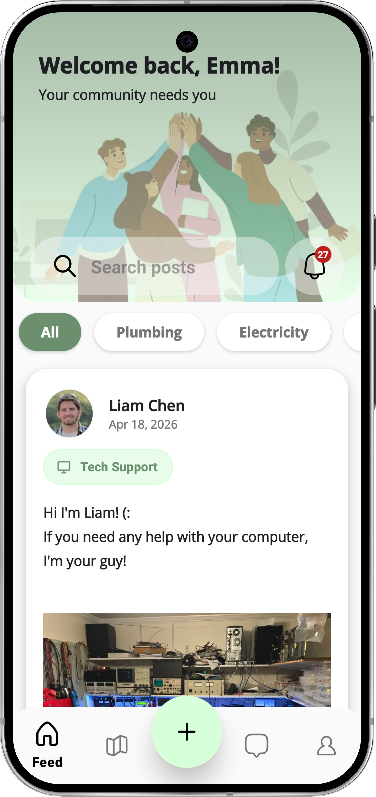
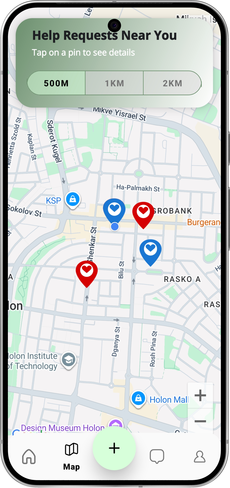
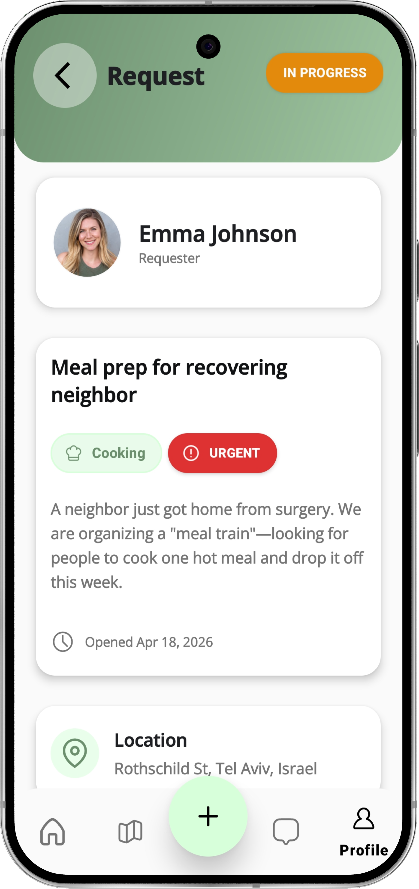
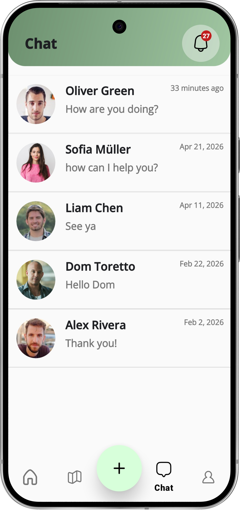
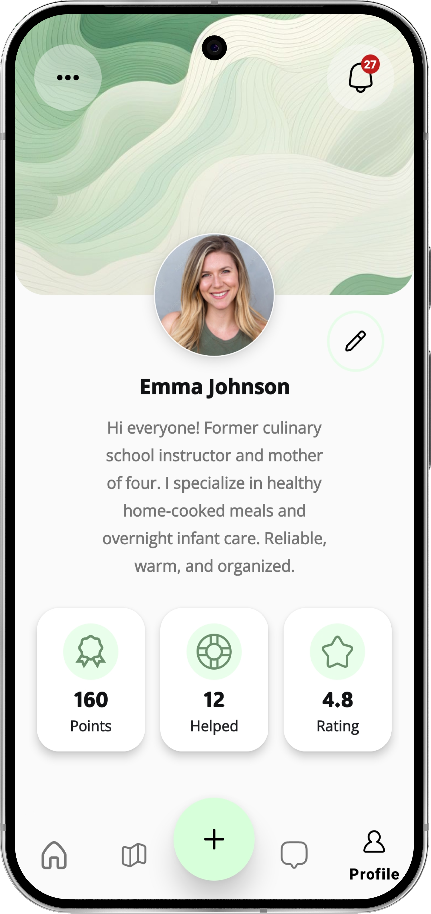

# AidHub - Community Mutual Aid Platform

AidHub is a powerful, real-time social platform designed to foster community solidarity. 
It enables users to open help requests, offer assistance, and discover community needs in their immediate vicinity. 
By leveraging location-based services and smart cloud logic, AidHub turns neighbors into a supportive network.

## 🌟 Vision
In a world that is becoming increasingly digital, AidHub brings the "Good Neighbor" spirit back to life. 
Whether it's moving a heavy couch, borrowing a tool, or providing professional advice, AidHub makes helping others accessible, immediate, and rewarding.

## 🚀 Core Features

* **Dual Engagement System:** Users can create **Help Requests** (Needs) or publish **Posts** (Service Offers) to build a balanced community ecosystem.
* **Interactive Map Integration:** A dynamic map view (Google Maps SDK) that displays nearby help calls based on the user's real-time location.
* **Advanced Feed & Search:** A high-performance feed with a sophisticated collapsing search UI that optimizes screen real estate while scrolling.
* **Real-time Communication:** Built-in messaging system for coordinating aid between users.
* **User Profiles:** Detailed profiles showing user contributions, with automated data synchronization across the entire platform.
* **Trust & Credibility System:** A comprehensive **Review & Rating system** where users can leave feedback after a completed aid interaction, ensuring a safe and reliable community.
* **Smart Proximity Notifications:** Integration with **Firebase Cloud Messaging** for instant push notifications. The system intelligently alerts users about nearby requests in their specific geographical radius that match their skill set.
* **Dark Mode Support:** A fully implemented **Dark Theme** for a modern look and better accessibility in low-light environments.

## 📱 Visual Showcase

| Dynamic Help Feed | Interactive Map | Request Details | Chatrooms screen | Detailed Profile |
| :---: | :---: | :---: | :---: | :---: |
|  |  |  |  |  |

## 🛠 Technical Excellence

* **Language:** Kotlin.

* **Architecture:** MVVM with Clean Multu-Module Architecture for maximum scalability and testability.
    * **:app Module:** Handles the UI layer (Fragments, ViewModels, UI Logic), DI setup, and navigation.
    * **:data Module:** A standalone module responsible for all data-related logic. It abstracts database access (Firestore), API calls, and Repository patterns, ensuring a strict separation between the Data Layer and the UI Layer.

* **UI/UX:** 
    * **ViewBinding:** For safe and efficient layout interaction.
	* **CoordinatorLayout & CollapsingToolbarLayout:** For complex toolbar animations and transitions.
    * **Glide & Lottie:** For efficient image loading and smooth vector animations.
	* **Material Design 3:** For the modern UI and Dark Mode support.
    * **Google Maps SDK:** For real-time location-based aid discovery.
	
* **Backend & Cloud Logic:**
    * **Firebase Firestore:** Real-time NoSQL database with geo-query capabilities.
    * **Cloud Functions (Node.js):** Backend triggers for maintaining data integrity and handling event-driven notifications.
	* **Firebase Cloud Messaging (FCM):** Real-time messaging based on FCM tokens. Tokens are refreshed and synchronized between the Android client and the Firestore users to ensure reliable delivery of push notifications.
    * **Cloud Storage:** Secure hosting for community-shared images.
	* **Firebase Authentication:** Secure login system supporting **Google Sign-In** and Email/Password providers.
    * **Location Services:** Precise handling of Android Location Permissions and FusedLocationProvider.

## ⚙️ How to Run

### Prerequisites:
* Android Studio Ladybug or newer.
* Android SDK 34 or higher.
* A physical Android device or Emulator with Google Play Services.

### Clone & Open:
Clone this repo and open it in Android Studio.
```bash
git clone https://github.com/KristinaGold/AidHub.git
```

### Firebase Setup:
To protect the original database and cloud resources of AidHub, the `google-services.json` file is **not** included in this repository. 

To run this project on your machine:
1. Create a new Firebase project at the [Firebase Console](https://console.firebase.google.com/).
2. Add an Android app to your project using the package name `com.example.aidhub` (as defined in `build.gradle`).
3. Download your unique `google-services.json` and place it in the `/app` directory.
4. Enable the necessary services: **Firestore**, **Authentication (Google/Email)**, **Cloud Messaging** and **Storage**.

   
### Cloud Functions Setup:
To enable the smart notification system and server-side data synchronization:

1. **Prerequisites**
* **Node.js:** Ensure you have Node.js installed (LTS version recommended). [Download here](https://nodejs.org/).
* **Firebase Account:** Your Firebase project must be on the **Blaze Plan** (Pay-as-you-go) to use Cloud Functions.
2. **Install Firebase CLI**
Open your terminal and install the Firebase command-line tools globally:
```bash
npm install -g firebase-tools
```
3. **Authentication**
Log in to your Google account associated with the Firebase project:
```bash
firebase login
```
4. **Initialize & Link Project**
Navigate to the root directory of the project and initialize the functions (if not already linked):
```bash
firebase init functions
```
	* Select "Use an existing project" and choose your AidHub project from the list.
	* When asked about the language, select JavaScript.
	* If prompted to overwrite index.js or package.json, select No (to keep the existing project logic).
5. **Deploy to the Cloud**
To upload the server-side logic (including the FCM notification triggers and User Profile sync logic) to Firebase, run:
```bash
firebase deploy --only functions
```

### Google Maps API:
Add your API Key to `local.properties` (located in the project's root folder).
```
GOOGLE_MAPS_API_KEY=[YOUR_API_KEY_HERE]
```
